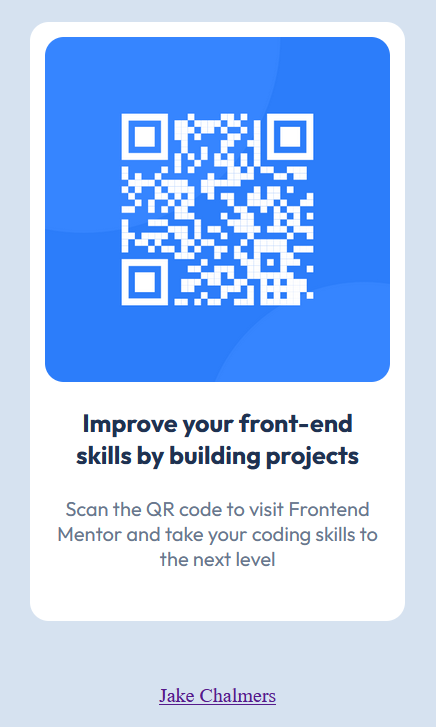

# [QR Code - UI](https://jakobcoding.github.io/Front-End-Mentor/)

A sleek, responsive web interface with Working QR code. Scan the code to visit Front-end Mentor.io, or click the with a at the bottom of the page to connect with me via LinkedIn.



## 🚀 Features

- **QR Code Solution UI:** Built with HTML and CSS
- **Styling**: CSS Selectors

- **Mobile-Friendly**: Works on all devices.

## 🛠️ Tech Stack

- HTML5, CSS

## 📦 Installation

1. Clone the repo:
   ```bash
   git clone https://github.com/JakobCoding/Front-End-Mentor.git
   ```
